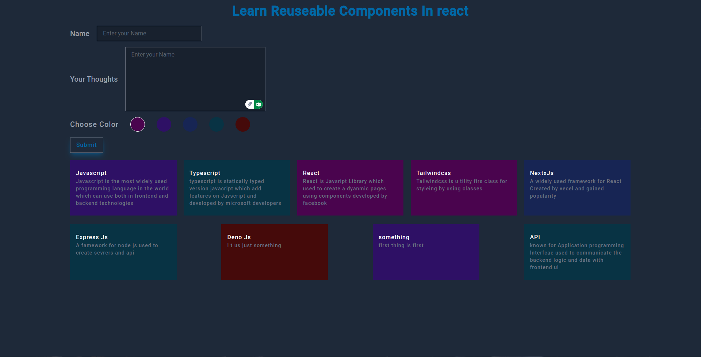

# Reusable Components In React

In this code I try to create a simple React + Vite app with tailwindccss
which shows how can we use components multiple times by taking userInputs and render the component multiple time

## 📸 Screenshots




## 🛠️ Built With

- **React** – Creating components
- **Tailwind CSS** – Styling

1. **Fork the repository** by clicking the `Fork` button at the top-right of this page.

### Clone repository:

```sh
git clone https://github.com/Abush-natanem-12/csec-web-development-bootcamp-codes/tree/main/reusable-component-react-day-one
```
